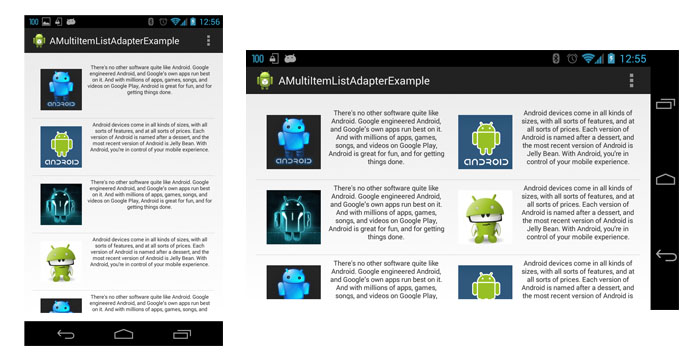
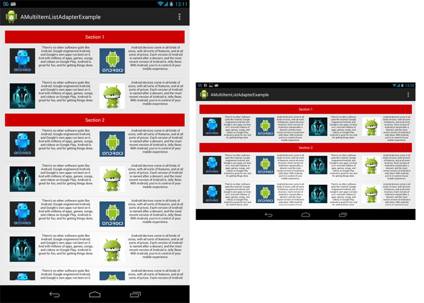

A Multi Item List Adapter
===========

__AMultiItemListAdapter__ is an adapter for ListView that allows you to have multiple items on a row based on your current adapter. Furthermore, you can also have the same functionality using sections.






## Usage

```java
int cellSpacing = (int)getResources().getDimension(R.dimen.cell_spacing);
int numberOfColumns = getResources().getInteger(R.integer.number_of_columns);
MultiItemListAdapter multiItemListAdapter = new MultiItemListAdapter(this, currentAdapter, numberOfColumns, cellSpacing);
list.setAdapter(multiItemListAdapter);
```


The constructor of MultiItemListAdapter takes four parameters: the current Context, the current adapter, the number of columns and the space between cells in pixels. The currentAdapter is the original adapter of the list. If you specify the number of columns and the cell spacing inside an xml you can have your listview changing based on the size of screen and orientation:

res/values/integers.xml

```xml
<?xml version="1.0" encoding="utf-8"?>
<resources>
    <integer name="number_of_columns">1</integer>
</resources>
```

res/values-land/integers.xml

```xml
<?xml version="1.0" encoding="utf-8"?>
<resources>
    <integer name="number_of_columns">2</integer>
</resources>
```


If you want to use the section version of AMultiItemListAdapter the behaviour is slightly different:

```java
int cellSpacing = (int)getResources().getDimension(R.dimen.cell_spacing);
int numberOfColumns = getResources().getInteger(R.integer.number_of_columns);
MultiItemListSectionAdapter multiItemListSectionAdapter = new MultiItemListSectionAdapter(this, numberOfColumns, cellSpacing);
MultiItemListHeader firstHeader = new MultiItemListHeader(0, firstViewHeader);
multiItemListSectionAdapter.addSection(firstHeader, firstAdapter);
multiItemListSectionAdapter.addSection(secondHeader, secondAdapter);
list.setAdapter(multiItemListSectionAdapter);
```
In this case you have to create a MultiItemListHeader for each section, this class takes two parameters: an index and the View that will use inside the list. Then for each section you have to add an header and the adapter for the elements.

## Supported Version

Android 4.0+


##License

```
Copyright 2015 Daniele Bottillo

Licensed under the Apache License, Version 2.0 (the "License");
you may not use this file except in compliance with the License.
You may obtain a copy of the License at

    http://www.apache.org/licenses/LICENSE-2.0

Unless required by applicable law or agreed to in writing, software
distributed under the License is distributed on an "AS IS" BASIS,
WITHOUT WARRANTIES OR CONDITIONS OF ANY KIND, either express or implied.
See the License for the specific language governing permissions and
limitations under the License.
```